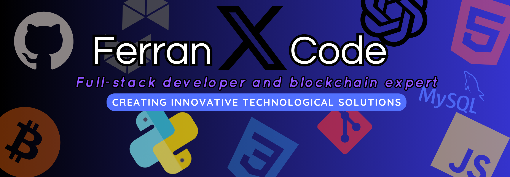

# Hello, I'm Ferran Coll 👨🏻‍💻 🇺🇸
### Full-Stack Developer and Blockchain Enthusiast 🚀

Hello! I'm Ferran Coll, a passionate aspiring Full-Stack developer and a technology blockchain enthusiast. This is my space where I share my journey in the world of web development and blockchain technology.

 

## About this Repository 📁

In this repository, you'll find the source code for my personal website, where I showcase my projects, skills, and my evolution as a developer. My goal is to create innovative web solutions and explore the exciting possibilities of blockchain technology.

 

## Technologies Used 🛠️

       

- Web Development: HTML, CSS, JavaScript
- Web Development: HTML, CSS, JavaScript
- Backend Technologies: Python, Node.js
- Front-End Frameworks: React, Vue.js
- Blockchain: Ethereum, Solidity

 

## Relevant Links 🌐

If you're interested in exploring my progress in the world of Full-Stack development and blockchain, I invite you to take a look at some of my most relevant repositories:

 

## Cryptocurrencies and Blockchain Technology 💰

I'm passionate about blockchain technology and its impact on the financial world and beyond. Here are some aspects related to cryptocurrencies and blockchain that interest me:

-  **Bitcoin (BTC)**: The pioneering cryptocurrency known for its role in the creation of blockchain technology.
  
-  **Ethereum (ETH)**: A leading blockchain platform that enables the creation of smart contracts and decentralized applications.
 
-  **Ethereum Virtual Machine (EVM)**: The EVM is the heart of Ethereum and enables the execution of smart contracts. It's fundamental for decentralization and automation in blockchain.

I'm excited to explore and learn more about these technologies and their transformative potential in various industries. If you have questions or want to discuss topics related to cryptocurrencies or blockchain, feel free to reach out!

## Contact Me 📫

If you have questions, suggestions, or just want to chat about web development or blockchain, don't hesitate to get in touch with me through:

 

 

I hope you enjoy exploring my repository! Thanks for visiting! 👋

------

# Hola, mi nombre es Ferran Coll 👨🏻‍💻 🇪🇸
### Desarrollador Full-Stack y Entusiasta de Blockchain 🚀

¡Hola! Soy Ferran Coll, un apasionado aprendiz de desarrollo Full-Stack y un entusiasta de la tecnología blockchain. Este es mi espacio donde comparto mi viaje en el mundo del desarrollo web y blockchain.

 

## Acerca de este repositorio 📁

En este repositorio encontrarás el código fuente de mi página web personal, donde muestro mis proyectos, habilidades y mi evolución como desarrollador. Mi objetivo es crear soluciones web innovadoras y explorar las emocionantes posibilidades de la tecnología blockchain.

 

## Tecnologías utilizadas 🛠️

 

- Desarrollo Web: HTML, CSS, JavaScript
- Tecnologías Back-End: Python, Node.js
- Frameworks Front-End: React, Vue.js
- Blockchain: Ethereum, Solidity

 

## Enlaces Relevantes 🌐

Si estás interesado en explorar mi progreso en el mundo del desarrollo Full-Stack y blockchain, te invito a echar un vistazo a algunos de mis repositorios más relevantes:

 

## Criptomonedas y Tecnología Blockchain 💰

Soy un apasionado de la tecnología blockchain y su impacto en el mundo financiero y más allá. Aquí hay algunos aspectos relacionados con criptomonedas y blockchain que me interesan:

-  **Bitcoin (BTC)**: La criptomoneda pionera, conocida por su papel en la creación de la tecnología blockchain.
  

-  **Ethereum (ETH)**: Una plataforma blockchain líder que permite la creación de contratos inteligentes y aplicaciones descentralizadas.
 

- 
 **Máquina Virtual Ethereum (EVM)**: La EVM es el corazón de Ethereum y permite la ejecución de contratos inteligentes. Es fundamental para la descentralización y la automatización en blockchain.
  
Me entusiasma explorar y aprender más sobre estas tecnologías y su potencial transformador en diversas industrias. Si tienes preguntas o deseas discutir temas relacionados con criptomonedas o blockchain, ¡no dudes en contactarme!

## Contáctame 📫

Si tienes preguntas, sugerencias o simplemente quieres charlar sobre desarrollo web o blockchain, no dudes en ponerte en contacto conmigo a través de:

 

 

¡Espero que disfrutes explorando mi repositorio! ¡Gracias por visitar! 👋

