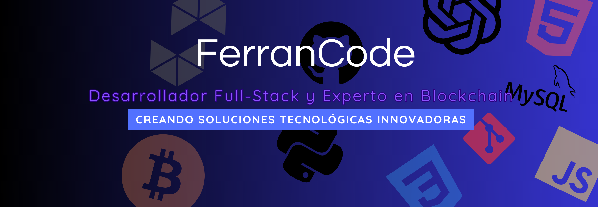

# Hola, mi nombre es Ferran Coll 👨🏻‍💻 
### Desarrollador Full-Stack y Entusiasta de Blockchain 🚀

¡Hola! Soy Ferran Coll, un apasionado aprendiz de desarrollo Full-Stack y un entusiasta de la tecnología blockchain. Este es mi espacio donde comparto mi viaje en el mundo del desarrollo web y blockchain.

 

## Acerca de este repositorio 📁

En este repositorio encontrarás el código fuente de mi página web personal, donde muestro mis proyectos, habilidades y mi evolución como desarrollador. Mi objetivo es crear soluciones web innovadoras y explorar las emocionantes posibilidades de la tecnología blockchain.

 

## Tecnologías utilizadas 🛠️

 

- Desarrollo Web: HTML, CSS, JavaScript
- Tecnologías Back-End: Python, Node.js
- Frameworks Front-End: React, Vue.js
- Blockchain: Ethereum, Solidity

 

## Enlaces Relevantes 🌐

Si estás interesado en explorar mi progreso en el mundo del desarrollo Full-Stack y blockchain, te invito a echar un vistazo a algunos de mis repositorios más relevantes:

 

## Criptomonedas y Tecnología Blockchain 💰

Soy un apasionado de la tecnología blockchain y su impacto en el mundo financiero y más allá. Aquí hay algunos aspectos relacionados con criptomonedas y blockchain que me interesan:

-  **Bitcoin (BTC)**: La criptomoneda pionera, conocida por su papel en la creación de la tecnología blockchain.
  

-  **Ethereum (ETH)**: Una plataforma blockchain líder que permite la creación de contratos inteligentes y aplicaciones descentralizadas.
 

- 
 **Máquina Virtual Ethereum (EVM)**: La EVM es el corazón de Ethereum y permite la ejecución de contratos inteligentes. Es fundamental para la descentralización y la automatización en blockchain.
  
Me entusiasma explorar y aprender más sobre estas tecnologías y su potencial transformador en diversas industrias. Si tienes preguntas o deseas discutir temas relacionados con criptomonedas o blockchain, ¡no dudes en contactarme!

## Contáctame 📫

Si tienes preguntas, sugerencias o simplemente quieres charlar sobre desarrollo web o blockchain, no dudes en ponerte en contacto conmigo a través de:

 

 

¡Espero que disfrutes explorando mi repositorio! ¡Gracias por visitar! 👋

